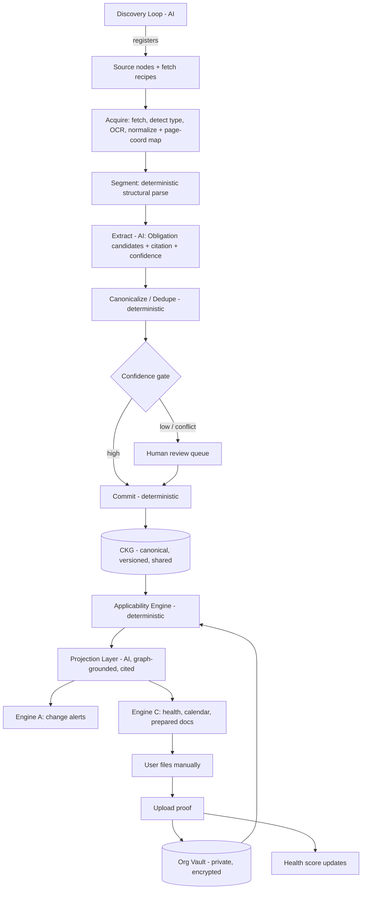
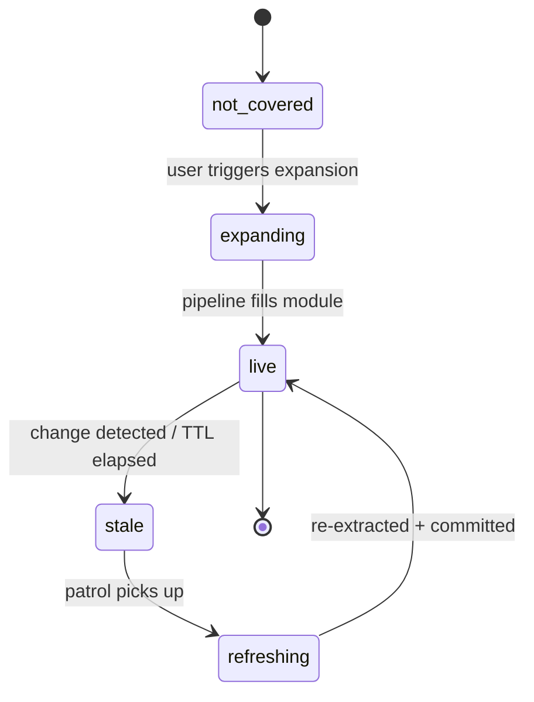
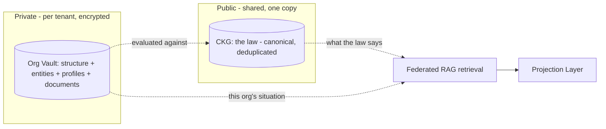

# Architecture Diagrams

## System data flow

```mermaid
flowchart TD
    DL[Discovery Loop - AI] -->|registers| SRC[Source nodes + fetch recipes]
    SRC --> ACQ[Acquire: fetch, detect type, OCR, normalize + page-coord map]
    ACQ --> SEG[Segment: deterministic structural parse]
    SEG --> EXT[Extract - AI: Obligation candidates + citation + confidence]
    EXT --> CAN[Canonicalize / Dedupe - deterministic]
    CAN --> GATE{Confidence gate}
    GATE -->|high| COMMIT[Commit - deterministic]
    GATE -->|low / conflict| HR[Human review queue]
    HR --> COMMIT
    COMMIT --> CKG[(CKG - canonical, versioned, shared)]

    OV[(Org Vault - private, encrypted)] --> APP[Applicability Engine - deterministic]
    CKG --> APP
    APP --> PROJ[Projection Layer - AI, graph-grounded, cited]
    PROJ --> ENGA[Engine A: change alerts]
    PROJ --> ENGC[Engine C: health, calendar, prepared docs]
    ENGC --> FILE[User files manually]
    FILE --> PROOF[Upload proof]
    PROOF --> OV
    PROOF --> SCORE[Health score updates]
```

## Coverage state machine

```mermaid
stateDiagram-v2
    [*] --> not_covered
    not_covered --> expanding: user triggers expansion
    expanding --> live: pipeline fills module
    live --> stale: change detected / TTL elapsed
    stale --> refreshing: patrol picks up
    refreshing --> live: re-extracted + committed
    live --> [*]
```

## The two graphs

```mermaid
flowchart LR
    subgraph Public[Public - shared, one copy]
      CKG[(CKG: the law - canonical, deduplicated)]
    end
    subgraph Private[Private - per tenant, encrypted]
      OV[(Org Vault: structure + entities + profiles + documents)]
    end
    OV -.evaluated against.-> CKG
    CKG -.what the law says.-> RAG[Federated RAG retrieval]
    OV -.this org's situation.-> RAG
    RAG --> PROJ[Projection Layer]
```
